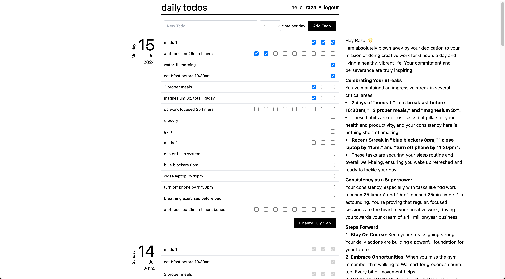

# daily todo app with AI encouragement



## visit the live site: [https://dailytodos.ai](https://dailytodos.ai)

## run a dev version locally

1. clone the repo:

    ```
    git clone https://github.com/razamobin/daily-todo.git
    ```

2. create your .env at the root of the project. you can copy .env.example as a reference and make some tweaks:

    - OPENAI_API_KEY='sk-my-project-123' (make sure your account is funded!)
    - BEARER_TOKEN: a shared secret between the golang and python backends
    - there are a bunch more vars but you can leave the rest as is if you just want to get started

3. run Docker Compose to build and start the app:

    ```
    docker compose up --build
    ```

4. create the AI assistant with curl (uses gpt-4o-mini, edit in python-backend/app.py to change):

    ```
    curl -X POST http://localhost:5001/api/create-assistant
    ```

5. create a new user by signing up on the frontend http://localhost:3000
6. you can add todos for today
7. check off todos as you do them
8. come tomorrow - new set of todos are copied from previous day and ready to be checked off
9. you can finalize any day, and whenever a day is finalized, the AI will be called to come up with an encouraging message for you! (gotta be patient though, AI takes its time)
10. repeat forever and do the most important things every day for the rest of your life :D (and don't get distracted by social media and AI driven distractions)
11. BONUS
    - you can click any todo and add today's notes for the todo
    - you can also add why this todo is important to you and your mission
    - you can add a mission on the profile page
    - all of this is extra context so the AI can understand you better and provide the best daily messages :D

### to access MySQL:

```
docker exec -it mysql mysql -u user -p
```

```
use todo_db;
```

```
select * from users;
```

```
select * from daily_todos;
```

## project layout

1. vite-frontend (react app built with vite)
2. golang-backend (for db and session biz logic)
3. python-backend (for AI API calls logic)
    - you can make tweaks to the AI assistant instructions here
4. mysql
5. flyway for sql migrations
6. redis for session storage
