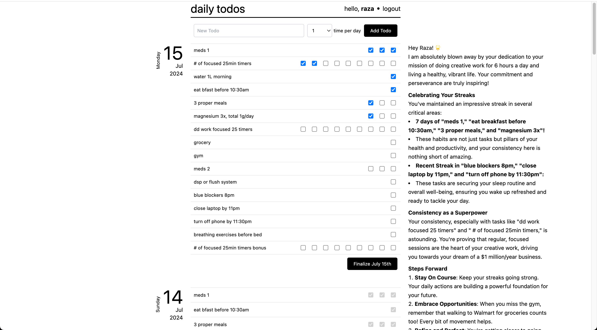

# daily todo app with AI encouragement



## visit the live site: [https://dailytodos.ai](https://dailytodos.ai)

## run a dev version locally

1. clone the repo:

    ```
    git clone https://github.com/razamobin/daily-todo.git
    ```

2. Create `.env` at the repository root using `.env.example`. Keep your existing
   database settings if you already started the app. Set `OPENAI_API_KEY` to an
   API key with billing and access to your selected model, and set a shared
   `BEARER_TOKEN` for the Go and Python backends.

   The AI settings are:

   ```dotenv
   OPENAI_MODEL=gpt-5.6-luna
   OPENAI_REASONING_EFFORT=low
   OPENAI_MAX_OUTPUT_TOKENS=4096
   OPENAI_TIMEOUT_SECONDS=90
   ```

   See [AI configuration and testing](docs/ai-migration.md) for model choices,
   configuration validation, and troubleshooting. The key stays in the Python
   backend; never put it in a `VITE_` variable.

3. Build and start:

   ```bash
   docker compose up --build
   ```

   Wait for Flyway migrations and the backends to finish starting. Assistant
   provisioning is no longer required. The former `/api/create-assistant`
   endpoint returns HTTP 410 with an explanation.

4. Open http://localhost:3000 and sign up. Add your mission on the profile page
   and create your daily todos. You can also add why each todo matters and notes
   about how it went.
5. Check off todos and finalize a day. Your encouragement streams into the page
   and is saved to MySQL. Reloading that day reuses the saved message. If
   generation or saving fails, the page shows an error and a retry button.

When upgrading an existing installation, use the same `.env` and Docker volumes.
This AI update needs no new database migration and preserves saved messages.
The old assistant/thread tables remain as historical data and are unused.

### to access MySQL:

```
docker exec -it mysql mysql -u user -p
```

```
use todo_db;
```

```
select * from users;
```

```
select * from daily_todos;
```

## project layout

1. vite-frontend (react app built with vite)
2. golang-backend (for db and session biz logic)
3. python-backend (for AI API calls logic)
    - edit `python-backend/prompts/daily_encouragement.md` to change the encouragement instructions
4. mysql
5. flyway for sql migrations
6. redis for session storage and coordination of daily AI requests
